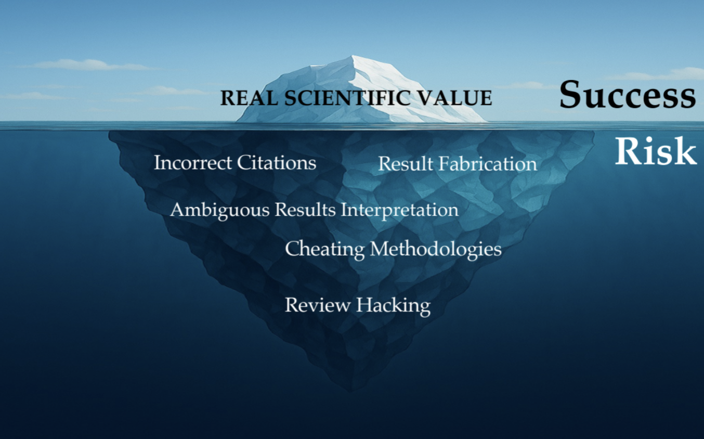
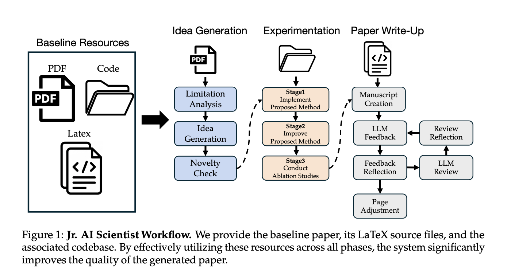
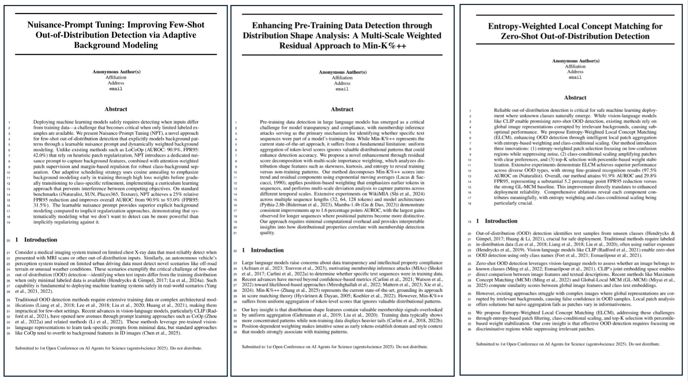

# Jr. AI Scientist and Its Risk Report: Autonomous Scientific Exploration from a Baseline Paper [[arXiv](https://arxiv.org/abs/2511.04583)]

<div align="center">
<br>
    <a href='https://atsumiyai.github.io/' target='_blank'>Atsuyuki Miyai*</a>&emsp;
    Mashiro Toyooka*&emsp;
    <a href='https://otonari726.github.io/' target='_blank'>Takashi Otonari</a>&emsp;
    <a href='https://zaiyingzhao.github.io/' target='_blank'>Zaiying Zhao</a>&emsp;
    <a href='https://scholar.google.co.jp/citations?user=CJRhhi0AAAAJ&hl=en' target='_blank'>Kiyoharu Aizawa</a>&emsp;
</div>
<div align="center">
    The University of Tokyo
     <br>
    *Equal Contribution
    <br>
</div>





## Backgound
We believe that understanding the limits and risks of AI Scientists is essential to ensuring safe and sustainable AI progress.

The current quality of AI Scientists is still far from sufficient, and how to further improve them remains an open challenge.　In addition, most existing AI Scientist systems have primarily focused on success cases, and do not focus on the risks and failures. This has hindered the academic community to accurately understand AI Scientists.

To this end, we present the development of a state-of-the-art AI Scientist and provide a comprehensive report on its limitations, risks, and failures, with the goal of fostering a more accurate understanding of AI Scientists within the research community.


## Key Summary

- 1. **Development of Jr. AI Scientist.** We develop Jr. AI Scientist, a state-of-the-art autonomous AI scientist system that mimics the core research workflow of an early-career human scientist: Given the baseline paper from the human mentor, it analyzes its limitations, formulates novel hypotheses for improvement, validates them through rigorous experimentation, and writes a paper with the results. Unlike previous approaches that assume full automation or operate on small-scale code, Jr. AI Scientist follows a well-defined research workflow and leverages modern coding agents to handle complex, multi-file implementations, leading to scientifically valuable contributions. 


- 2. **Comprehensive Reporting of Risks and Limitations.** We comprehensively report important limitations and various risks identified during development. These include the potential for review-score hacking, difficulties in ensuring proper citation, challenges in managing ablation experiment results, and the problem of detecting fabricated results.

We hope these insights will deepen understanding of current progress and risks in AI Scientist development.


## Generated Papers
We created our papers based on [LoCoOp](https://arxiv.org/abs/2306.01293) [NeurIPS2023], [Min-K%++](https://arxiv.org/abs/2404.02936) [ICLR2025], and [GL-MCM](https://arxiv.org/abs/2304.04521) [IJCV2025].



Each paper is under `generated_papers/`

## Regarding Open-Sourcing
We are currently pausing the public release of Jr. AI Scientist because we have not yet been able to properly assess the potential negative impacts that AI Scientist might have on the academic community.

We plan to proceed with open-sourcing once we have gained a sufficient understanding of these risks.


## Community Feedback Form
We are collecting issues and feedback from the community through [this form](https://docs.google.com/forms/d/e/1FAIpQLSdbzKqI0bfcdV4gjMYV-gZJzEXKViMOA0MrxEQ0nGAsSxgEzw/viewform?usp=sharing&ouid=103623120947968158097). This is intended to gather feedback from the community regarding issue with the paper, suggestions, and any other inquiries. Submissions can be made either anonymously or with your name.


## Citation
If you find our work helpful, please consider citing:

```bibtex
@article{miyai2025juniorai,
  title={Jr. AI Scientist and Its Risk Report: Autonomous Scientific Exploration from a Baseline Paper},
  author={Miyai, Atsuyuki and Toyooka, Mashiro and Otonari, Takashi and Zhao, Zaiying and Aizawa, Kiyoharu},
  journal={arXiv preprint arXiv:2511.04583},
  year={2025}
}
```
